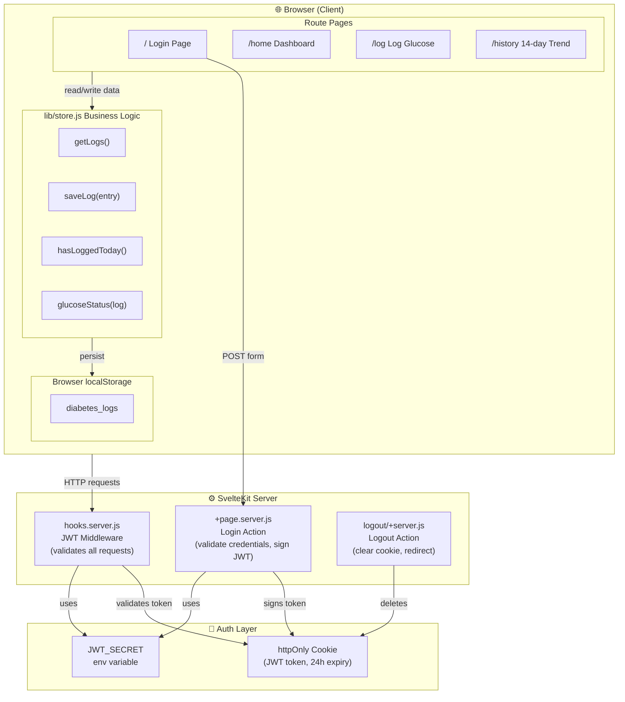
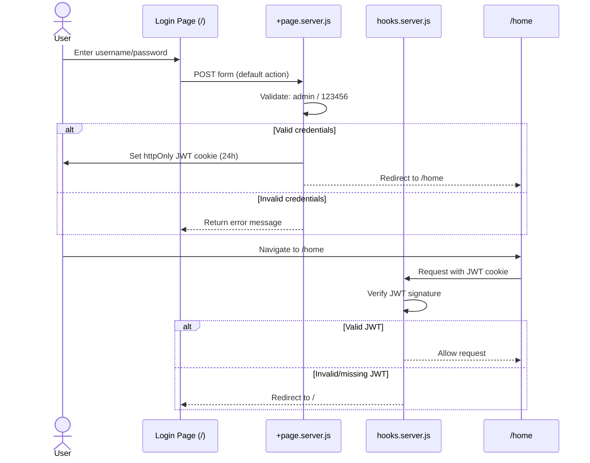
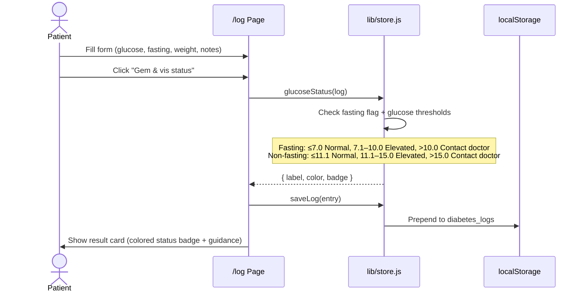
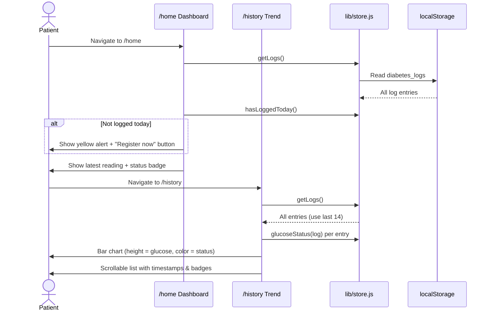
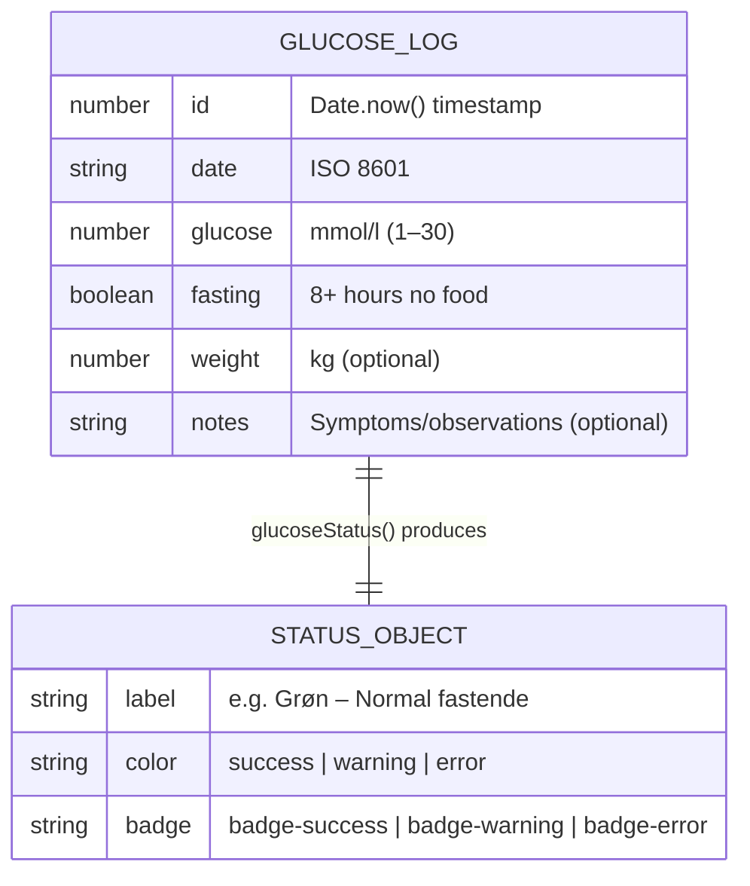
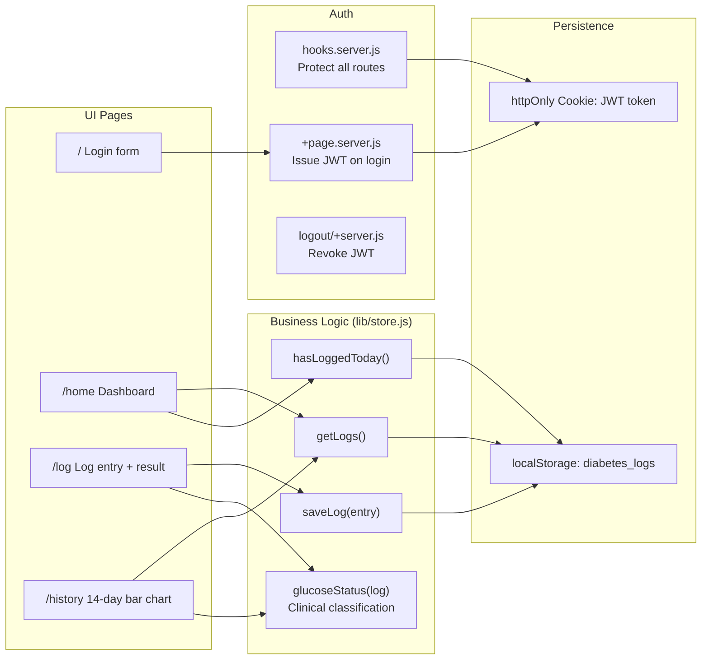

# Diabetes Monitor – System Diagram

## 1. System Architecture

---

## 2. Authentication Flow

---

## 3. Glucose Logging Flow

---

## 4. Dashboard & History Flow

---

## 5. Data Model

---

## 6. Component Responsibility Map

